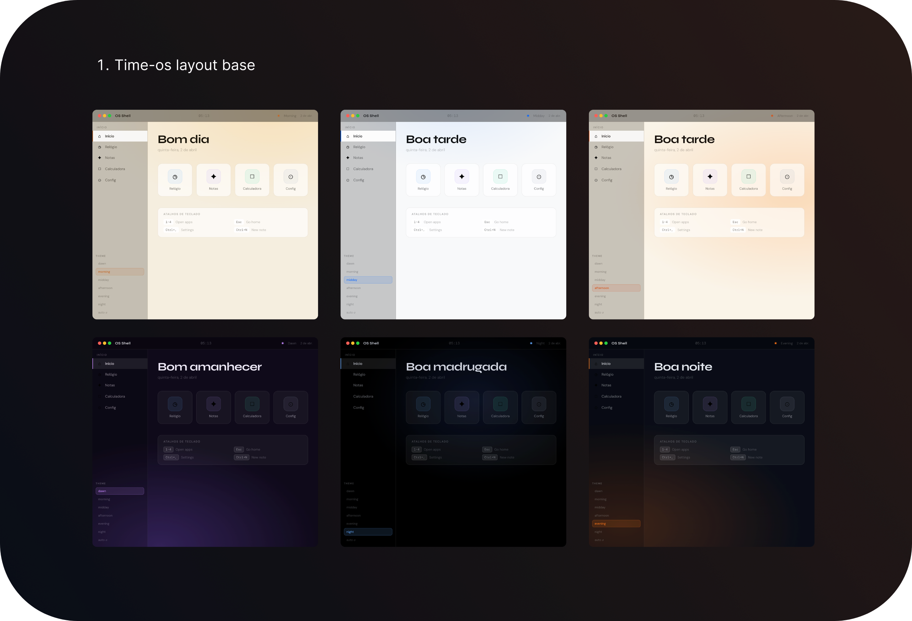

# Time OS

A web-based operating system shell / desktop environment simulator built as a Progressive Web App (PWA). It simulates a minimal OS interface with a top bar, sidebar navigation, app launcher, and multiple built-in applications. The UI dynamically adapts its theme based on the time of day.



## Features

### Core Shell
- **Top Bar** — macOS-style window controls, live clock, online status indicator, date display
- **Sidebar Navigation** — App list with icons, active state highlighting, theme override controls
- **App Launcher** — Home screen with animated app grid, greeting based on time of day
- **Window System** — Animated transitions between apps, multi-window stack management
- **Keyboard Shortcuts** — `1-4` to open apps, `Esc` for home, `Ctrl+,` for settings, `Ctrl+N` for new note

### Built-in Apps
1. **Clock** — SVG analog clock with hour/minute/second hands + digital time display
2. **Notes** — CRUD notes with sidebar list, search, title/body editing, auto-save (IndexedDB)
3. **Calculator** — Standard calculator with basic arithmetic operations
4. **Settings** — Theme, language, permissions manager, system info

### Time-Based Theming
Six distinct themes that auto-switch based on the hour:
- **Dawn** (5-7) — Purple-tinted dark
- **Morning** (7-12) — Warm light
- **Midday** (12-15) — Clean white/blue
- **Afternoon** (15-18) — Warm golden light
- **Evening** (18-21) — Dark with orange glow
- **Night** (21-5) — Pure dark with blue accents

### Internationalization
Fully supports 4 languages: English, Portuguese, Spanish, French (auto-detected from browser locale).

### PWA Support
- Service worker for offline functionality
- iOS home screen installation support
- Offline data persistence via IndexedDB

## Tech Stack

| Technology | Purpose |
|---|---|
| React 18 | UI framework |
| Vite 5 | Build tool & dev server |
| Framer Motion | Animations & transitions |
| Dexie | IndexedDB wrapper |
| i18next | Internationalization |
| vite-plugin-pwa | PWA support |

## Getting Started

```bash
# Install dependencies
npm install

# Start development server
npm run dev

# Build for production
npm run build
```

The development server runs on port 3000.
